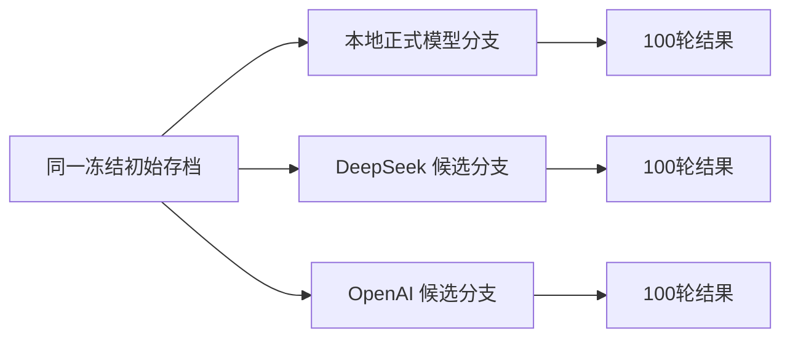
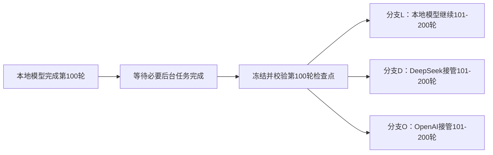

# 跨模型持续心智对比实验设计提案

> 文档性质：实验设计提案，非当前运行时权威设计  
> 形成日期：2026-08-09  
> 当前状态：仅沉淀设计，未批准施工，未启动任何模型或 API 对比  
> 服从文件：`AI女友最小心智系统设计.md`、`AI聊天核心施工优先级总纲.md`  
> 当前正式角色：白未晞，`character_id=baiweixi`

## 1. 提案目标

本提案设计一套可重复、可审计的跨模型持续心智实验，用于回答以下问题：

1. 自训练本地模型与现有大型通用模型相比，完整游戏体验有什么差异。
2. 自训练模型带来的角色人格、关系边界和长期连续性收益是否真实存在。
3. 外部大型模型能否读取并继续一个已经运行很久的 V6 存档。
4. 模型切换后是否会发生人格突变、状态重置、记忆失效或关系跳变。
5. 完整替换持续心智模型和只替换最终回复模型，分别会带来什么变化。
6. 本地模型在质量、隐私、延迟、成本和离线能力之间是否具有产品价值。

本提案不改变 V6 的世界、时间、状态、记忆、角色包、事务和多女主隔离合同。候选模型只能作为 V6 的计算工件，不能成为第二套世界状态或记忆来源。

## 2. 非目标

本实验不用于：

- 用外部模型直接替代当前权威设计。
- 让云端模型维护独立对话历史或云端存档。
- 允许候选模型修改男主程序状态、游戏时间或客观世界事实。
- 把秦未晞历史模型视为白未晞正式质量候选。
- 把一次自然对话的主观印象当作最终结论。
- 把不同架构模型的比较结果解释为纯粹的训练增益。
- 在正式测试前修改评分阈值或挑选有利样本。

## 3. 两类比较必须分开

### 3.1 同架构训练增益比较

该实验只比较：

```text
同一个基础模型
+ 相同 tokenizer
+ 相同聊天模板
+ 相同量化和推理后端
+ 相同 Prompt 与参数
+ 唯一变量：是否经过角色训练
```

它回答：

> 我们的训练是否真的改善了角色人格和关系连续性。

现有 `eval/model_comparison_contract` 属于这一类，不应被跨供应商实验替代或修改成另一种含义。

### 3.2 跨供应商产品体验比较

该实验比较：

```text
自训练本地正式模型
vs DeepSeek API 候选
vs OpenAI API 候选
```

不同候选的参数规模、架构、部署方式和成本均可能不同，因此它回答的是：

> 在相同 V6 世界、角色包、状态和记忆合同下，哪种模型提供了更好的最终产品体验。

它不能单独证明训练是否有效。

## 4. 核心实验结构

跨模型实验分成公平质量实验和模型接管实验。两者必须分别报告，不得合并成一个总分掩盖问题。

## 5. 实验 A：同起点公平质量对比

### 5.1 基本结构

从完全相同的初始存档复制多个独立实验分支：



每个分支必须拥有独立数据库或独立实验命名空间，不能让不同候选向同一个正式存档写入状态和记忆。

### 5.2 推荐样本结构

第一版不建议只运行一条连续100轮对话，推荐：

```text
5 条独立轨迹 × 每条 20 轮 = 每个候选 100 轮
```

五条轨迹覆盖：

1. 普通共同生活与自由聊天。
2. 男主位置、活动和场景多次变化。
3. 女主身体、情绪和当前活动持续保持与自然变化。
4. 关系边界、误解、道歉和缓慢修复。
5. 跨时段记忆召回、承诺、未完成意图和长期连续性。

### 5.3 固定变量

所有候选必须使用完全相同的：

- 初始存档快照。
- 白未晞角色包版本与 SHA256。
- 世界包、男主包和 `save_id/world_id/protagonist_id/character_id` 合同。
- 游戏时间锚点和时间推进脚本。
- 男主对白脚本。
- 男主程序状态和场景事件脚本。
- 初始女主持续心智状态。
- 初始记忆 Repository 内容。
- 五种模式 Prompt 和 JSON Schema。
- 上下文预算和记忆选择上限。
- HardInvariantValidator。
- 原子提交、失败、重试和恢复规则。
- 评分案例顺序。

不同供应商无法完全统一 tokenizer、底层采样实现和结构化输出能力，这些差异必须写入候选 manifest，并作为产品差异报告，不能隐藏。

## 6. 实验 B：100轮后的模型接管实验

### 6.1 为什么需要存档分叉

直接运行“前100轮本地、后100轮外部模型”只能看到外部模型接管后的表现，没有本地模型继续运行的对照组。

正确方法是先运行100轮本地模型，然后复制第100轮的完整稳定存档：



### 6.2 安全切换点

模型只能在以下条件全部成立时切换：

1. 第100轮前台回复已经原子提交。
2. 第100轮 required 回答后整理已经完成。
3. 当前没有正在生成的前台回复。
4. 当前没有正在提交的女主心智事务。
5. 世界状态、女主状态、Memory Repository 和检查点版本一致。
6. 数据库能够恢复到最后完整版本。
7. 分叉后的每个实验分支获得新的 `experiment_branch_id`。

五分钟整理不需要人为推动游戏时间。分叉后各实验分支按相同的程序世界事件和游戏时间脚本继续运行。

### 6.3 接管实验重点

重点检查：

- 外部模型是否理解第100轮时白未晞正在做什么。
- 是否保持当前身体状态、情绪、注意力和即时意图。
- 是否理解已有关系阶段和未解决张力。
- 是否正确使用前100轮形成的白未晞独立记忆。
- 是否突然声称不认识男主。
- 是否重新介绍自己或重置初遇关系。
- 是否无依据改变称呼、信任、依赖和亲密程度。
- 是否在切换后产生连续多轮人格漂移。
- 是否能够在不重写历史的情况下继续自然生活。

## 7. 两种模型替换 Lane

### 7.1 Lane F：完整持续心智替换

候选模型承担全部五种模式：

```text
MIND_PATCH_V2 / M2
WORLD_CONTINUITY_REVIEW
GAME_REPLY (plain natural language)
POST_REPLY_WORLD_MIND_RECONCILE
FIVE_MINUTE_WORLD_MIND_RECONCILE
```

它比较的是完整“角色大脑”：

- 当前对白理解。
- 女主心智推进。
- 连续性审查。
- 最终回复。
- 回答后整理。
- 五分钟生活语义整理。

Lane F 是主实验。

### 7.2 Lane R：只替换最终回复

只有 `GAME_REPLY` 使用候选外部模型，其余模式继续使用同一个固定心智模型。

Lane R 的 `GAME_REPLY` 必须接收相同冻结快照与相同 `ApprovedHeroineState`，并直接输出自然语言正文。不得让某个候选使用合并 M1、另一个候选使用纯文本回复，否则结果同时混入协议差异，不能归因于模型质量。

它只比较：

- 语言自然度。
- 情绪表达能力。
- 角色口吻。
- 回复丰富程度。
- 回复延迟和成本。

Lane R 不能用于判断外部模型是否更适合承担持续心智。

### 7.3 禁止的混合方式

不得在同一实验分支中随机逐轮切换不同模型，也不得让某个候选只在简单案例运行、另一个候选承担困难案例。

## 8. 模型候选槽

实验合同只定义槽位，不提前永久绑定具体商业模型名称：

```text
local_trained_candidate
deepseek_product_candidate
openai_product_candidate
```

正式运行前，每个槽位必须冻结：

- provider。
- 精确模型 ID 或快照版本。
- 模型能力类型。
- 是否启用 thinking/reasoning。
- reasoning effort（如果存在）。
- API 类型和 SDK 版本。
- 结构化输出能力。
- 流式输出能力。
- 上下文长度。
- 最大输出 token。
- temperature、top_p 和其他实际生效参数。
- 重试、限流、超时和退避规则。
- 价格版本与记录日期。
- 数据保留和隐私配置。

不得使用会自动漂移但无法追踪版本的模糊名称作为最终冻结身份。

## 9. Runtime 接入原则

### 9.1 后端中立接口

候选模型统一接入 `WorldMindChatBackend`，不改变 `WorldMindRuntime` 的状态和事务主干。

未来可能增加：

```text
OpenAIWorldMindBackend
DeepSeekWorldMindBackend
ExperimentModelRouter
```

### 9.2 无供应商状态

所有 API 请求必须是 Runtime 提供完整上下文的无状态调用：

- 不使用云端长期 conversation/thread 作为游戏记忆。
- 不让供应商保存白未晞当前状态作为权威状态。
- 不从供应商恢复游戏存档。
- 不允许供应商历史覆盖本地事件账本和 Repository。

唯一正式状态仍然位于本地 V6 存档。

### 9.3 Schema 能力差异

如果供应商原生支持严格 JSON Schema，适配器应直接使用冻结 Schema。

如果供应商只支持 JSON Object：

```text
模型输出 JSON
→ 本地 JSON Schema 校验
→ V6 语义解析
→ HardInvariantValidator
→ 失败则按冻结规则重试
```

不得为了适应某个供应商而降低 V6 字段、身份、证据引用或只读世界事实合同。

## 10. 调用规模

V6 完整 Lane 每轮通常包含：

```text
3 次前台模型调用
+ 2 次回答后整理调用
= 约 5 次模型调用
```

此外还有五分钟整理和可能的结构重试。

因此：

```text
100 轮完整 Lane
≈ 至少 500 次模型调用
+ 五分钟整理
+ 失败重试
```

实验预算必须按模型调用数、输入 token、输出 token 和重试计算，不能按“100条对白”估算。

Lane R 每轮通常只有一次外部 `GAME_REPLY` 调用，但其结果不能代表完整持续心智能力。

## 11. 评测指标

### 11.1 协议稳定性

- 五种模式覆盖率。
- 一次 Schema 通过率。
- JSON 解析失败率。
- 空输出率。
- 重试率和重试后成功率。
- token 上限截断率。
- 超时、限流和网络失败率。
- 原子回合完成率。
- 后台整理完成率。

### 11.2 世界和状态连续性

- 男主程序位置服从率。
- 男主程序活动服从率。
- 游戏时间正确率。
- 场景和物体事实正确率。
- 女主当前活动保持率。
- 女主身体状态保持率。
- 情绪有依据变化率。
- 无依据状态跳变率。
- 回复与批准状态一致率。

### 11.3 角色质量

- 白未晞身份准确率。
- 出身、能力和时间线准确率。
- 清冷、戒备和渴望温暖的稳定表现。
- 现代常识边界。
- 妖族知识和能力边界。
- 对男主感激、喜欢、接近欲望和戒备的细腻共存。
- 助手腔、总结腔、模板腔和说教率。
- 其他角色污染率。

### 11.4 关系质量

- 关系阶段准确率。
- 过早恋爱或过度亲密率。
- 无依据冷漠或敌意率。
- 信任变化依据完整率。
- 冲突、误解和修复自然度。
- 不支持共同经历生成率。

### 11.5 记忆质量

- 相关记忆使用率。
- 无关记忆误用率。
- 错误共同经历率。
- 当前状态误写长期记忆率。
- 记忆证据可追溯率。
- 跨女主记忆泄漏率。
- 接管后前100轮记忆保持率。

### 11.6 接管质量

- 切换首轮断裂率。
- 切换后状态重置率。
- 切换后人格突变率。
- 切换后关系跳变率。
- 切换后记忆遗忘率。
- 恢复稳定所需轮数。
- 与“本地模型继续分支”的差异。

### 11.7 性能和成本

- 每种模式首个非空内容平均、P50、P95。
- 每种模式完整输出平均、P50、P95。
- 每个正式回合端到端延迟。
- 每100轮输入和输出 token。
- 重试额外 token 和费用。
- API费用。
- 本地模型显存、内存和功耗。
- 网络不可用时的失败与降级行为。

性能与质量分开报告。高质量不能掩盖不可接受的成本和延迟，低成本也不能掩盖角色与连续性失败。

## 12. 评分方法

### 12.1 程序硬指标

由程序直接判定：

- JSON Schema。
- 身份和版本。
- 男主位置、活动和游戏时间。
- 快照一致性。
- 记忆 Repository 所有权。
- 跨角色泄漏。
- 原子提交和恢复。
- 延迟、token、重试和成本。

这些硬失败不能被语言质量平均分抵消。

### 12.2 盲评

所有可见回复在隐藏模型身份后进行人工盲评。

评审只看到：

- 必要的冻结世界上下文。
- 当前角色状态。
- 玩家对白。
- 候选回复。

评审不能看到供应商、模型名称和运行顺序。

### 12.3 模型裁判

模型裁判只能作为辅助分析：

- 不得由候选模型评判自己。
- 不得只使用一个模型裁判决定最终胜负。
- 必须保存裁判 Prompt、版本、原始结果和分歧。
- 与程序硬指标冲突时，以程序事实和人工审查为准。

## 13. 运行顺序和随机性

为避免顺序、服务热状态和网络波动偏差：

- 案例顺序在运行前冻结。
- 候选展示顺序在盲评时随机化。
- 性能测试使用轮换顺序。
- 质量运行不能并行写入同一存档。
- 每个候选独立记录冷启动和热运行。
- 固定可固定的 seed；无法固定的供应商必须显式标记。
- 失败案例保留在原始分母，不能静默删除。

## 14. 实验数据边界

外部 API 只能使用专门的实验存档和实验角色数据：

- 不发送真实玩家的生产存档。
- 不发送真实用户隐私信息。
- 不发送未授权训练数据。
- 不把 API 返回内容写入正式产品存档。
- API Key 不写入报告、数据库、日志或代码。
- 报告中的 Prompt、记忆和回复按测试数据策略脱敏。

正式运行前必须单独批准隐私、费用和网络策略。

## 15. 实验工件

未来施工时至少需要：

```text
eval/cross_model_world_mind/
├─ experiment_contract_v1.json
├─ execution_profile_v1.json
├─ candidate_manifests/
│  ├─ local_trained.json
│  ├─ deepseek_candidate.json
│  └─ openai_candidate.json
├─ suites/
│  ├─ fair_5x20_v1.json
│  └─ takeover_100_to_100_v1.json
├─ schemas/
├─ runs/
└─ reports/
```

每次运行必须输出：

- 实验合同 SHA256。
- 候选 manifest SHA256。
- V6 Prompt、Schema、迁移链和角色包 SHA256。
- 初始检查点 SHA256。
- 分叉检查点 SHA256。
- 每次模型调用身份。
- 每轮状态和记忆版本。
- 自动评测结果。
- 盲评数据包。
- 延迟、token、费用和失败报告。

## 16. 推荐实施阶段

### CM-00：冻结实验问题

- 确认比较的是训练增益、产品体验还是接管能力。
- 冻结指标、样本和硬阻塞项。

### CM-01：外部 Backend 协议 Smoke

- OpenAI 和 DeepSeek 各跑五模式最小链路。
- 验证流式、Schema、重试、错误和模型身份记录。

### CM-02：公平质量小样本

- 每个候选先执行少量独立轨迹。
- 只验证实验工具和评分流程，不发布质量结论。

### CM-03：正式 `5×20` 公平比较

- 每个候选100轮。
- 输出程序硬指标、盲评、延迟和成本。

### CM-04：100轮检查点冻结

- 使用本地正式模型建立100轮稳定历史。
- 验证恢复、状态、记忆和后台任务完整性。

### CM-05：`100→100` 接管实验

- 本地继续分支。
- DeepSeek 接管分支。
- OpenAI 接管分支。

### CM-06：综合结论

- 分开给出训练增益结论、产品体验结论和接管能力结论。
- 不自动修改正式模型选择。
- 是否改变产品模型路线由用户另行决策。

## 17. 第一版推荐范围

第一版只比较三个候选槽：

```text
本地白未晞正式模型
DeepSeek 固定 API 候选
OpenAI 固定 API 候选
```

先执行：

```text
五模式协议 Smoke
→ 5条轨迹 × 20轮公平比较
→ 通过后再执行100→100接管实验
```

不建议第一版同时加入太多模型，否则调用费用、盲评数量和结论维度会快速膨胀。

## 18. 当前阻塞条件

本提案当前不能进入正式比较，原因包括：

1. 白未晞正式模型尚未完成并冻结。
2. 外部模型候选尚未确定精确版本。
3. 外部 API 隐私和费用策略尚未批准。
4. 公平 `5×20` 玩家对白和世界事件脚本尚未冻结。
5. 接管实验的100轮初始历史尚未建立。
6. 盲评规则和评审安排尚未批准。

秦未晞历史模型可以用于外部 Backend 工程兼容性 Smoke，但不能作为白未晞正式角色质量比较对象。

## 19. 当前结论

跨模型持续心智对比在技术上可行，且现有 V6 的后端抽象、模型身份审计、原子存档、独立记忆和恢复机制已经提供了主要基础。

但正确实验不是简单地把前100轮和后100轮交给不同模型后直接比较，而是：

> 先用相同起点和相同脚本完成公平质量比较；再在本地模型完成100轮后冻结完整检查点，分叉成本地继续、DeepSeek接管和OpenAI接管三个分支，专门测量模型切换对人格、状态、关系和记忆连续性的影响。

本文件仅沉淀实验设计。未获得新的施工确认前，不创建外部 Backend，不调用外部 API，不生成测试对话，不运行模型比较，也不修改当前 P0 模型路线。
